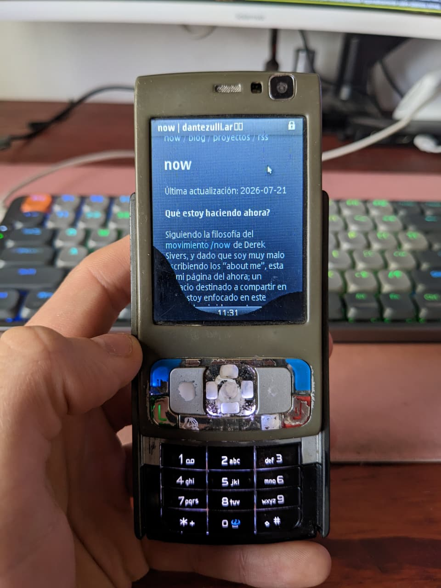
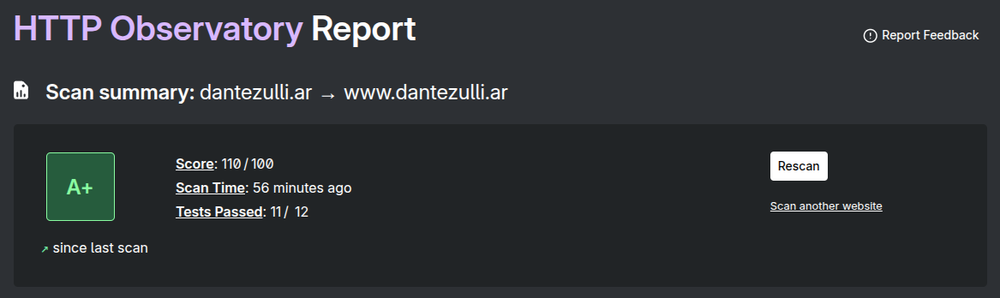
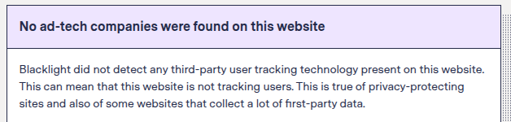

+++
title = "Blog"
date = "2026-01-12"
description = "Esta mismísima página"
group = "active"
author = "Dante Zulli"
link = "https://github.com/DanteZulli/blog"
layout = "single"
+++

> Mi sitio web, corriendo sin problemas en mi (vaqueteadísimo) Nokia N95 <3

Quienes me conocen sabrán (y para quienes no, les comento), yo no soy muy fanático de JavaScript.

Para empezar, no me gusta como lenguaje de programación. Si bien yo siempre fui más de los lenguajes compilados y fuertemente tipados (con una especial apreciación por Java y C# que fueron con los que empecé en mis primeros trabajos), considero que su filosofía y principios contribuyen a una destrucción paulatina del internet, que aún estamos atravesando.

No es noticia que hoy en día las páginas web son cada vez más pesadas. Recuerdo que antes estaba bien marcada la diferencia entre una "página web" y una "aplicación web" propiamente dicha, sus alcances y objetivos, y sobretodo su _propósito_. Hoy en día esa linea se desdibujó completamente, y sitios que _NO NECESITAN_ uso de JavaScript, lo aplican de manera descarada, volviendo el internet (en mi opinión) cada vez menos accesible, e inseguro.

Más allá de mi apreciación personal respecto a este, considero además que esta deformación contribuyó a lo que hoy llamamos ["la crisis de obesidad en los sitios web"](https://idlewords.com/talks/website_obesity.htm). El "chiste" de que cada vez agregamos más y más código innecesario (como el paquete para saber [si un número es igual a trece](https://www.npmjs.com/package/is-thirteen)) ya no es tan chiste, y la innecesaria búsqueda del próximo gran framework que destrone a React (que jamás va a llegar) nos está alejando del propósito principal del internet; __el intercambio efectivo de información y comunicación.__

Para quienes aún no comprendan de lo que les estoy hablando, los invito a entrar a [isthistechdead.com](https://isthistechdead.com/) y hacer una pequeña búsqueda de tecnologías completamente "muertas". Cuántas de estas son frameworks web? Cuánto de esto es JS? Ahora, compárenlo con los lenguajes o plataformas.

La estabilidad, madurez y propósito (más que la búsqueda por llamar la atención) deberían de ser nuestra prioridad a la hora de programar. 

Es por eso que este sitio web fue [hecho para durar](https://jeffhuang.com/designed_to_last/) y considero todos los desarrolladores web deberíamos replantearnos si _de verdad es necesario_ implementar ese framework, esa librería, o agregar ese nuevo CDN, y a cambio de qué? Que estamos perdiendo en el medio, a quién o que estamos dejando atrás. Evaluar si de verdad vale la pena esa animación "fancy" por sobre que nuestro contenido perdure en el tiempo, que lo que compartimos esté disponible para la mayor cantidad de usuarios posibles, y a qué internet queremos contribuir con lo que hacemos.\
La [indie web](https://en.wikipedia.org/wiki/IndieWeb) al fin y al cabo la hacemos nosotros, somos nosotros, y pienso que complejizarla más sólo "porque sí" no es el camino correcto.

## Mi pequeño granito de arena

Es hora de hablar de esta mismísima página.

Está hecha con [Hugo](https://gohugo.io/), mi framework de generación de sitios estáticos de preferencia, y me permite seguir los principios de [Jeff](https://jeffhuang.com/) lo más de cerca posible. Si bien lo que escribo es [markdown](https://www.markdownguide.org/), una vez compilado es HTML y CSS plano, que puedo agarrar y llevarme sin problema para colgarlo en cualquier lado.
Está muy bien documentado y me brinda muchas facilidades, la experiencia de desarrollo es muy buena, facilita mucho el mantenimiento del sitio, compila rapidísimo, produce resultados ligeros, y se integra muy bien con flujos de desarrollo agéntico.

> Dato curioso: Antes estaba hecho en [Astro](https://astro.build/) (sí, un framework de JS), pero para mi caso de uso, escribir en MD y armar templates en [Go](https://go.dev/) es mucho más práctico.

En términos de **seguridad y privacidad**, el reporte de [HTTP Observatory by Mozilla](https://developer.mozilla.org/en-US/observatory/analyze?host=dantezulli.ar) es mi marcador de referencia. 

El único test que me falla es el de _"Add SRI to external scripts."_, y eso es por los scripts que inyecta Cloudflare para las métricas e insights del sitio, ya que como les contaba anteriormente, esto **no tiene JavaScript de mi parte**.\
Se debería de solucionar cuándo hostee esto en mi homelab, pero para eso primero tengo que tener uno xD

Hablando acerca de tracking no deseado, anuncios embebidos, analíticas de uso que invaden la privacidad del usuario, y otras razones para odiar a Google, el reporte de [Blacklight by The Markup](https://themarkup.org/blacklight?url=dantezulli.ar&device=mobile&location=us-ca&force=false) es mi principal fuente de tranquilidad, sobre todo antes de confiar en algún host-provider para mi sitio, y también considero deberían tener un filtro como este antes de confiar en cualquier sitio que consulten (incluyendo este, obvio).

En lo que respecta al rendimiento, siempre intento mantener este sitio lo más ligero y rápido posible, ya que soy muy fanático de optimizar recursos. Pienso que es la mejor forma de combatir (y exponer) a la obsolescencia programada, y de incluir a la mayor cantidad de usuarios posibles. Para todo lo que respecta a rendimiento y/o velocidad en la navegación uso [Google Lighthouse](https://pagespeed.web.dev/analysis/https-dantezulli-ar/a7cuvpiphd)

> Además suelo probar en mi Nokia N95, y en mi daily; el Pixel 4 (que no pueden abrir Reddit, Facebook o Twitter con ligereza, pero sí este sitio :D)

Esta sección posiblemente sufra actualizaciones, ya que los estándares (y mis expectativas) respecto a estos 3 grandes temas (seguridad y privacidad, tracking y rendimiento) van evolucionando, y con ello este sitio.\
Sin ir más lejos, cuándo comencé no existía la métrica de "Agentic Browsing" y ahora que estoy más metido en tema, también es una de mis prioridades a la hora de desarrollar.

### Agradecimientos

No quería cerrar este post sin hacer una mención especial a [Caio Lente](https://lente.dev/), y a [Herman Martinus](https://herman.bearblog.dev/) cuyo trabajo y contribuciones me animaron a hacer este blog posible, y cuyos posts me invitaron a leer y adentrarme mucho más en la materia!
